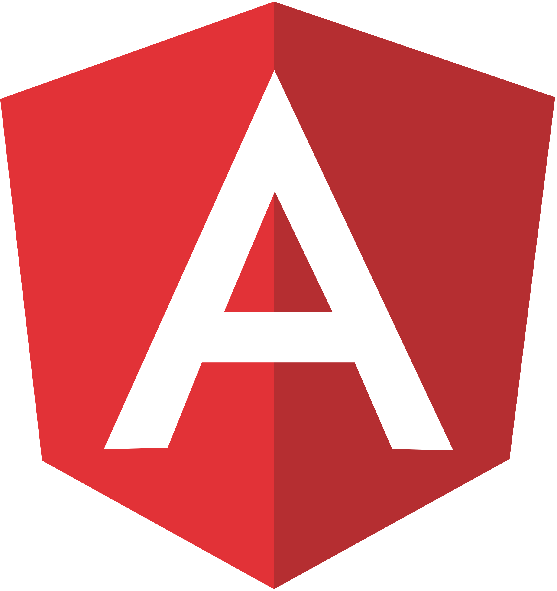
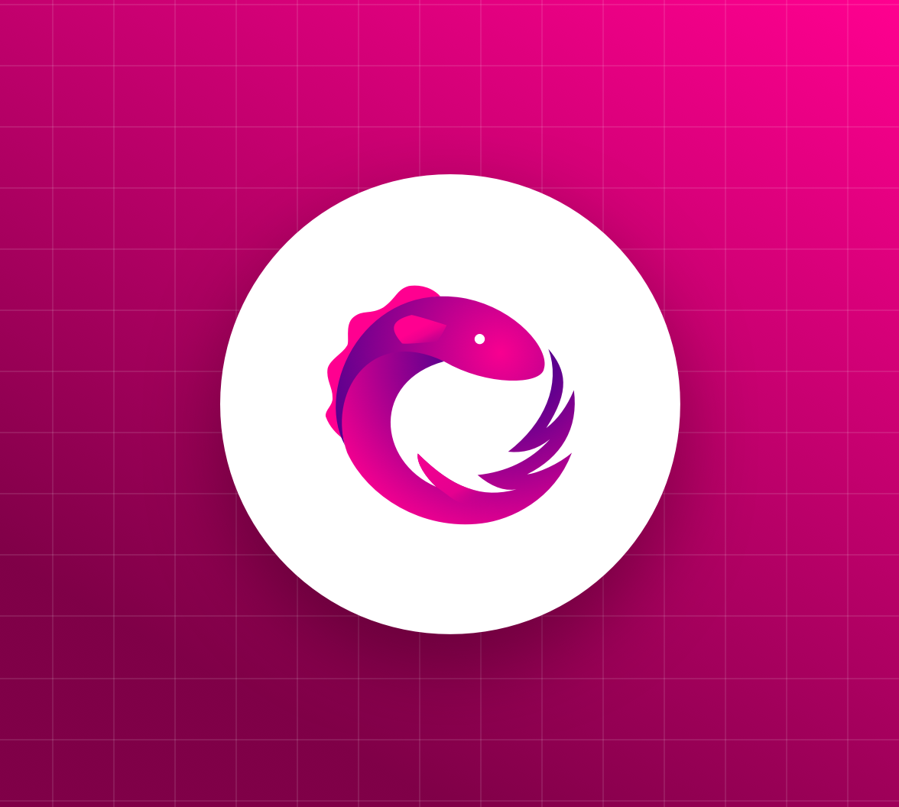
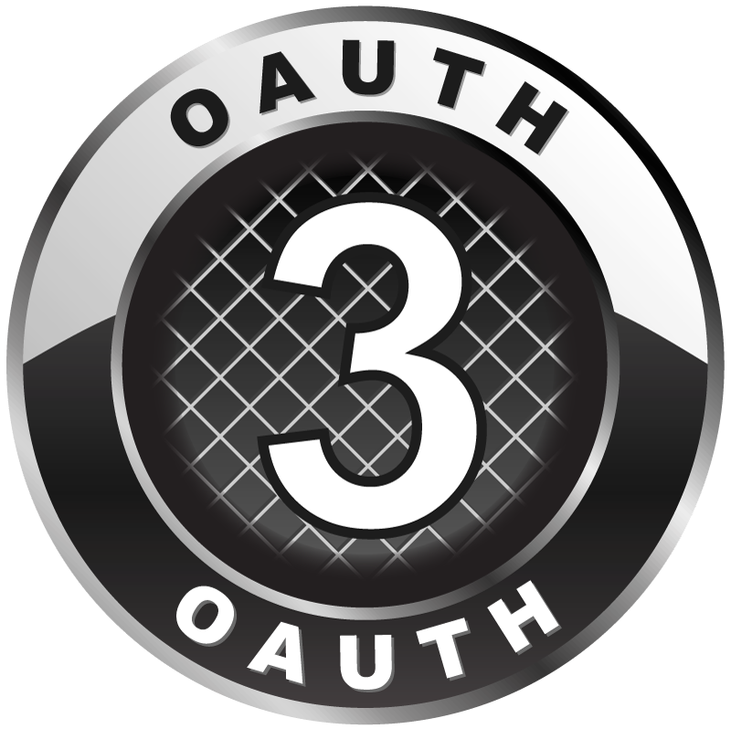
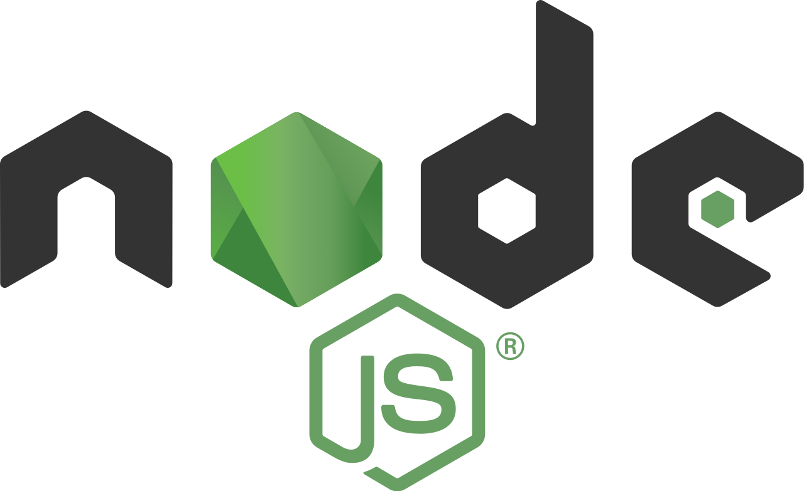

### Hi there 👋
### Ahmed Khalil fresh graduated student from CIS Faculty Mansoura Grade of excellent with honors

- 🔭 I’m currently working at Bdaya development - Egypt
- 🌱 I’m currently learning Microservices
- 👯 I’m looking to collaborate on Dotnet projects
- 💬 Ask me about Distributed systems and Large scale Apps
- 📫 How to reach me: send me email on progeng_ahmed_khalil@outlook.com
- ⚡ Fun fact: Keep coding

## 𝗦𝘁𝗮𝘁𝘀

## Technologies

<table>
<tr>
<td width="10%">

</td>
<td width="10%">

</td>
<td width="10%">

</td>

<td width="10%">

</td>

<td width="10%">

</td>
<td width="10%">

</td>
</tr>
<tr>
<td width="10%">

</td>
<td width="10%">

</td>

<td width="10%">

</td>

<td width="10%">

</td>

<td width="10%">

</td>
<td width="10%">

</td>
</tr>
<tr>
<td width="10%">

</td>
<td width="10%">

</td>
<td width="10%">

</td>
<td width="10%">

</td>
<td width="10%">

</td>
</tr>
</table>

