### Hi there 👋
### Ahmed Khalil graduated student from CIS Faculty Mansoura Grade of excellent with honors 2020.

<svg xmlns="http://www.w3.org/2000/svg" width="1000" height="430" viewBox="0 0 1000 430">
  
  
  <rect width="100%" height="100%" fill="#1e1e1e" rx="10" ry="10" />
  
  <!-- Summary Age Display at top -->
  <rect class="summary-container" x="50" y="15" width="900" height="40" />
  <text id="age-summary" class="summary" x="500" y="42">00 Years : 00 Months : 00 Days : 00:00:00</text>
  
  <line class="separator" x1="20" y1="70" x2="980" y2="70" stroke-width="2" stroke-dasharray="none" />
  
  <!-- Years -->
  <text id="years-label" class="label" x="20" y="100">YEARS</text>
  <text id="years-value" class="digit" x="180" y="100">00</text>
  <rect class="progress-bg" x="300" y="85" width="680" height="20" />
  <rect id="years-progress" class="progress-fill" x="300" y="85" width="0" height="20" />
  <text id="years-cycle" class="cycle-info" x="985" y="97">0/12</text>
  
  <line class="separator" x1="20" y1="117.5" x2="980" y2="117.5" />
  
  <!-- Months -->
  <text id="months-label" class="label" x="20" y="165">MONTHS</text>
  <text id="months-value" class="digit" x="180" y="165">000</text>
  <rect class="progress-bg" x="300" y="150" width="680" height="20" />
  <rect id="months-progress" class="progress-fill" x="300" y="150" width="0" height="20" />
  <text id="months-cycle" class="cycle-info" x="985" y="162">0/30</text>
  
  <line class="separator" x1="20" y1="182.5" x2="980" y2="182.5" />
  
  <!-- Days -->
  <text id="days-label" class="label" x="20" y="230">DAYS</text>
  <text id="days-value" class="digit" x="180" y="230">00000</text>
  <rect class="progress-bg" x="300" y="215" width="680" height="20" />
  <rect id="days-progress" class="progress-fill" x="300" y="215" width="0" height="20" />
  <text id="days-cycle" class="cycle-info" x="985" y="227">0/24</text>
  
  <line class="separator" x1="20" y1="247.5" x2="980" y2="247.5" />
  
  <!-- Hours -->
  <text id="hours-label" class="label" x="20" y="295">HOURS</text>
  <text id="hours-value" class="digit" x="180" y="295">000000</text>
  <rect class="progress-bg" x="300" y="280" width="680" height="20" />
  <rect id="hours-progress" class="progress-fill" x="300" y="280" width="0" height="20" />
  <text id="hours-cycle" class="cycle-info" x="985" y="292">0/60</text>
  
  <line class="separator" x1="20" y1="312.5" x2="980" y2="312.5" />
  
  <!-- Minutes -->
  <text id="minutes-label" class="label" x="20" y="360">MINUTES</text>
  <text id="minutes-value" class="digit" x="180" y="360">0000000</text>
  <rect class="progress-bg" x="300" y="345" width="680" height="20" />
  <rect id="minutes-progress" class="progress-fill" x="300" y="345" width="0" height="20" />
  <text id="minutes-cycle" class="cycle-info" x="985" y="357">0/60</text>
  
  <line class="separator" x1="20" y1="377.5" x2="980" y2="377.5" />
  
  <!-- Seconds -->
  <text id="seconds-label" class="label" x="20" y="425">SECONDS</text>
  <text id="seconds-value" class="digit seconds" x="180" y="425">00000000</text>
  <rect class="progress-bg" x="300" y="410" width="680" height="20" />
  <rect id="seconds-progress" class="progress-fill" x="300" y="410" width="0" height="20" />
  <text id="seconds-cycle" class="cycle-info" x="985" y="422">0/1000</text>
  
  <!-- Birthdate info -->
  <text class="birthdate-info" x="970" y="15">Since: January 1, 1998</text>
  
  
</svg> 

 

### Visitor Since 31 -12-2022

 
  Visitor count 
  

## 🏆 GitHub Trophies

 
 

## 𝗦𝘁𝗮𝘁𝘀

 

## Technologies

  &nbsp;
  &nbsp;
  &nbsp;
  &nbsp;
  &nbsp;
  &nbsp;
  &nbsp;
  &nbsp;
  &nbsp;
  &nbsp;
  &nbsp;
  &nbsp;
  &nbsp;
  &nbsp;
  &nbsp;
  
   
     
   
   
   
   
   
   
   
   
   
   
   
   

